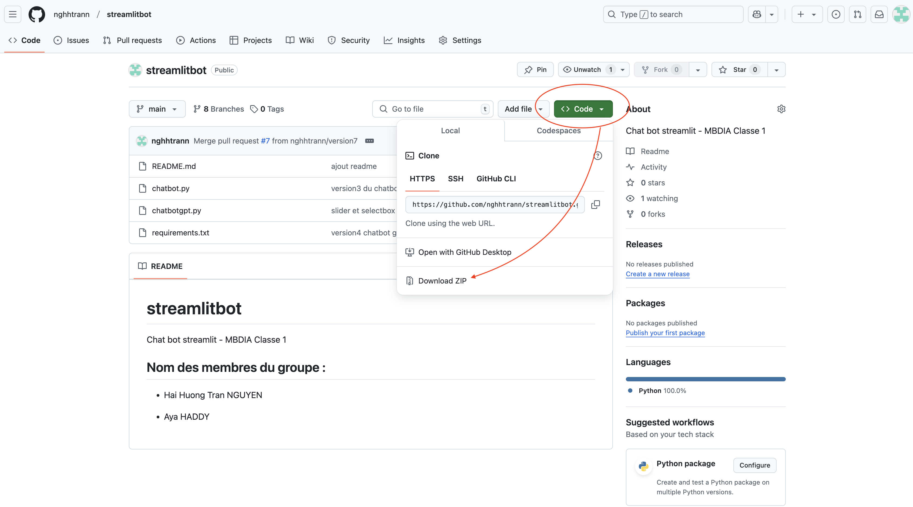
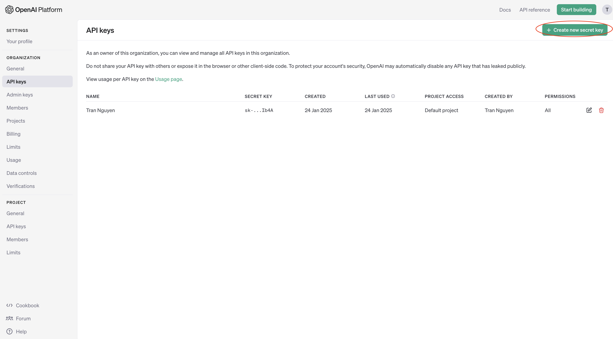

# streamlitbot
Chat bot streamlit - MBDIA Classe 1

## Nom des membres du groupe :

- Hai Huong Tran NGUYEN

- Aya HADDY

  ## Commandes à suivre pour récupérer la code et comment l'exécuter

1. Aller sur le site : https://github.com/nghhtrann/streamlitbot

2. Télécharger le zip depuis le répository



3. Extraire le zip pour obtenir un dossier

4. Ouvrir le dossier **streamlitbot-main** dans VSCode

5. Vérifier que **git** est bien disponible sur votre pc avec la ligne de code ci-dessous

```
git --version
````

6. Vérifier que **Python** est bien disponible sur votre pc avec les lignes de code ci-dessous

```
python --version

ou 

python3 --version
```

7. Vérifier que **pip** est installé correctement avec les lignes de code ci-dessous
```
pip --version

ou

pip3 --version
```

8. Installer les librairies requises pour exécuter les fichiers .py avec la ligne de code ci-dessous
```
pip install -r requirements.txt
```

9. Vérifiez que **Streamlit** est correctement installé avec la ligne de code ci-dessous
```
streamlit hello
```

10. Exécuter le fichier **chatbot.py** avec la ligne de code ci-dessous
```
streamlit run chatbot.py
```

### Pour le fichier <u>chatbotgpt.py</u>, il faut créer une clé API et un ficher pour sauvegarder la clé.

1. Créer un compte  ou se connecter sur OpenAI

2. Une fois que vous avez créé votre compte OpenAI et que vous vous êtes connecté à votre compte, suivre ce lien https://platform.openai.com/settings/organization/api-keys

3. Cliquer sur **"Create new secret key"** et copier cette clé API nouvellement générée.


4. Créer le dossier **.streamlit** dans le dossier **streamlitbot-main**

5. Dans le dossier **.streamlit**, créer le fichier **secrets.toml** avec les lignes de code ci-dessous

```
OPENAI_API_KEY = "YOUR_API_KEY"
```
Remplacer *YOUR_API_KEY* avec <u>la clé API nouvellement générée (au point 3)</u>

6. Exécuter le fichier **chatbotgpt.py** avec la ligne de code ci-dessous

```
streamlit run chatbotgpt.py
```

**J'espère que notre travail sera clair! :)**
